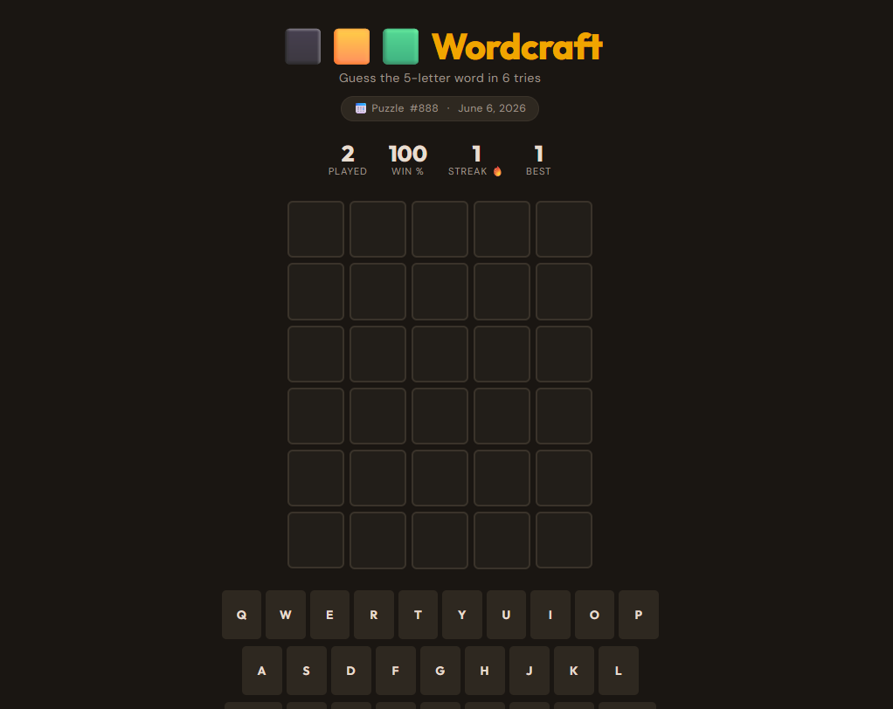
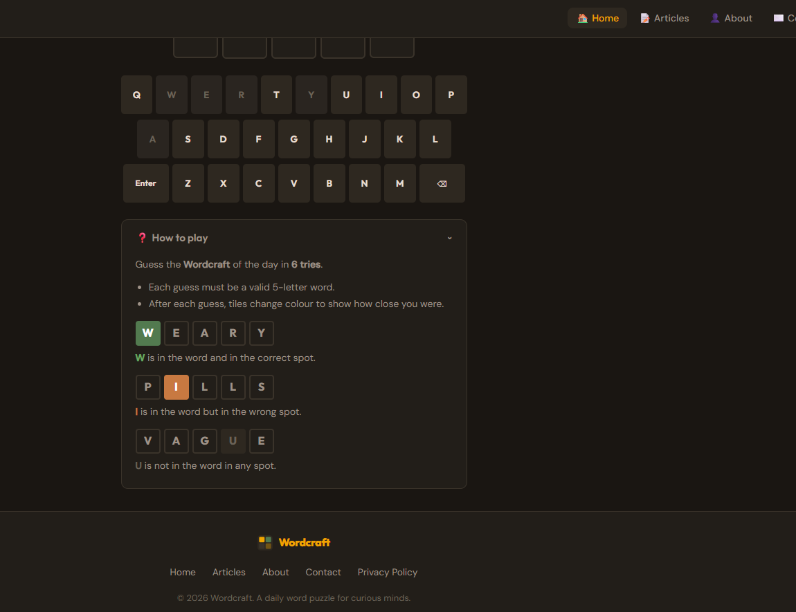

# wordcraft - Built with FastAPI + Jinja2 + SQLite

A web application for wordcraft built with FastAPI, Jinja2 and SQLite.

## Live Demo

- Demo: [wordcraft](https://gamenewspaper.com/)
- Source: [GitHub](https://github.com/cq1824538531/wordcraft)




## Tech Stack

| Layer | Technology |
|-------|------------|
| Backend | Python 3.x + FastAPI |
| Frontend | HTML + CSS + JavaScript |
| Database | SQLite |
| Platform | Windows 10/11 / Linux / macOS |

- **Frontend**: HTML5, CSS3, JavaScript
- **Backend**: Python, FastAPI, Jinja2, SQLite

## Getting Started

**1. Install Python 3.x**

[Download here](https://www.python.org/downloads/)

**2. Install dependencies**

```bash
pip install fastapi uvicorn jinja2
```

**3. Run the project**

```bash
uvicorn main:app --reload
```

Then visit http://localhost:8000

## FAQ

**1. Where is the database?**

The `.db` file is in the project root. No additional database installation needed.

**2. Project structure?**

- `main.py` — backend entry point
- `templates/` — Jinja2 templates
- `static/` — static assets

**3. What do I need to know?**

Python basics, FastAPI, Jinja2 template syntax, and basic HTML/CSS/JS.

**4. How to deploy to a server?**

```bash
uvicorn main:app --host 0.0.0.0 --port 8000
```
